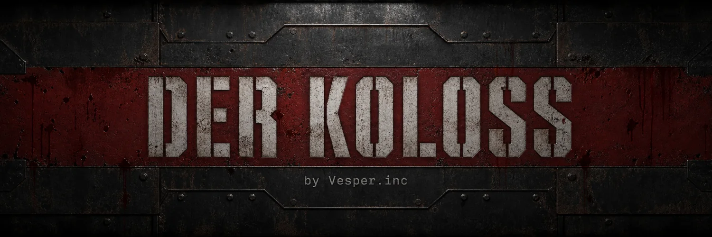

# Der Koloss — Community Edition

**The Colossus Awakens** — a free, browser-based round-based zombie survival game, built as a tribute to *Der Riese*.

Made by [Vesper](https://vesper.inc). Play it at **[derkoloss.com](https://derkoloss.com)**.

One factory. Four soldiers. As many rounds as you can survive.

📺 **[See it in motion](https://x.com/0xRishi/status/2081230708593590378)** — the version 2 transformation, with sound.

> **Community Edition** is the open-source cut of Der Koloss: the complete game, with everything operational stripped out. No analytics, no telemetry, no feedback collector, no accounts, no keys. It makes no network calls beyond its own assets and the public PeerJS broker that introduces co-op peers. Fork it, run it, take it apart.
>
> **Snapshot as of 26 July 2026.** This is a point-in-time cut of the production codebase and may not reflect the latest version live on [derkoloss.com](https://derkoloss.com).

---

## What it is

Der Koloss rebuilds the rhythm of classic round-based Zombies for the open web. Start with a sidearm and 500 points, repair barricades, open the factory a room at a time, buy wall weapons, spin the Mystery Box, collect perks, and turn ordinary guns into strange new machines. Every round gets faster and less forgiving.

Power the facility. Link the teleporters. Reach the Pack-a-Punch. Then keep moving when the walls begin to close in.

It runs directly in the browser with [Three.js](https://threejs.org) — **no engine, no install, no build step.**

| | |
|---|---|
| **Modes** | Solo + four-player online co-op |
| **Arsenal** | 31 weapons — wall buys, Mystery Box, wonder weapons |
| **Systems** | Perks, power, traps, teleporters, Pack-a-Punch |
| **Extras** | In-game voice chat, character select, custom loadouts, cheat codes |

Co-op runs peer-to-peer over [PeerJS](https://peerjs.com) with a short lobby code or invite link — no server, no account, no sign-up. Up to four players with voice chat, revives, shared objectives, and a scoreboard.

## Controls

Desktop browser, keyboard and mouse. Click into the battlefield to capture the pointer; press `Esc` to pause or release it.

| Input | Action |
|---|---|
| `WASD` | Move through the factory |
| `Mouse` | Look and aim |
| `LMB` / `RMB` `E` | Fire / aim down sights |
| `R` `I` | Reload / inspect weapon |
| `1` `2` `Q` | Select or swap weapons |
| `F` | Buy, rebuild, revive, interact |
| `V` `G` `X` | Knife / grenade / Monkey Bomb |
| `Shift` `Space` `C` | Sprint / jump / crouch |
| `T` `Tab` `Esc` | Flashlight / scoreboard / pause |

**First-round advice:** knife the early zombies while they're weak, repair boards for spare points, and don't open every route at once. Find the power switch before committing to perks. In co-op, stay within revive distance — but leave enough room to train the horde when the floor gets crowded.

## Running locally

There is no build step and no dependency install. Serve the repository root over any static web server:

```bash
python3 -m http.server 8000
```

Then open `http://localhost:8000`. Opening `index.html` as a `file://` URL will **not** work — ES modules and the import map require a real HTTP origin.

Any static server works equally well:

```bash
npx serve .
```

### Routes

| Path | Page |
|---|---|
| `/` | Menu and game |
| `/about` | About the project |
| `/assets` | Asset archive — audio catalog and animated armory models |

## How it was made

Almost nothing in Der Koloss was modeled in advance.

The factory itself — every wall, stair, catwalk, and doorway — along with all 31 weapons, the Pack-a-Punch, the perk machines, the mystery box, the teleporters, the hellhounds, and the night sky over the courtyard, is **generated from code at runtime**: a few hundred primitives, lathed, extruded, merged, and surfaced by shaders written for this project. There is no model library sitting behind any of it.

The exceptions are worth naming precisely, and they're small: two CC0 zombie meshes provide the only rigged skeleton in the game — the horde, the player, and the four co-op soldiers all move on it — plus two blood decals and six CC0 surface textures. Every other texture, from machined gunmetal to the chalk sketches on the wall buys, is drawn onto a canvas as the game loads. Every sound effect and voice was generated with ElevenLabs.

### Two versions

It exists in two versions, and both are still visible in the design.

**Version 1** established the whole game — the map, the rounds, the arsenal, the perks, the co-op. It was written with Kimi K3 as the model and OpenCode as the harness.

**Version 2** changed no room, no round, and no rule. It kept every system and rebuilt what you see and hear on top of them: the rendering, the models, the movement, and the mix. It was built with Claude Opus 5 inside Claude Code. `RENDERING.md` documents that overhaul in detail.

## Rendering

Version 1 played correctly and looked like a prototype. Version 2 is why it doesn't anymore. The short version: **the forward renderer no longer draws to the screen.** `js/render/PostFX.js` owns the frame, and everything below happens between the world pass and your monitor.

```
world  ──► sceneRT (RGBA16F, 4× MSAA, float depth texture)
             │
             ├─► SAO ambient occlusion (½ res) ─► depth-aware bilateral blur
             ├─► volumetric raymarch (½ res, shadow-mapped moon + 4 practicals)
             └─► depth
             ▼
        resolve: colour × AO, + in-scattered light, bilateral upsample
             ▼
        screen-space reflections (puddle mask only)
             ▼
        camera motion blur (depth reprojection vs. previous view-projection)
             ▼
        depth of field (ADS / cinematic)
             ▼
        VIEWMODEL PASS  ◄── own camera, own FOV, own depth buffer
             ▼
        bloom: soft-knee prefilter ─► 6-mip Karis downsample ─► tent upsample
             ▼
        composite: chromatic aberration, CAS sharpen, bloom + lens dirt,
                   exposure, AgX tonemap, lift/gamma/gain grade, damage
                   vignette, film grain, linear→sRGB
             ▼
        FXAA ─► backbuffer
```

A few decisions do most of the heavy lifting:

**The forward pass is linear.** Tone mapping is off in three.js and the scene renders into a half-float buffer. Exposure, colour conversion, and grading all happen in the composite, against real HDR values rather than already-clipped ones.

**AgX, not ACES.** Highlights desaturate toward white instead of clipping to a hue. That single choice is most of why muzzle flashes and sodium lamps read like film instead of like blown-out video.

**The viewmodel is its own pass.** It renders on a separate layer with a fixed 75° lens, its own near/far range, and its own depth buffer — after every depth-consuming pass. So your weapon receives bloom, grading, grain, and AA, but contributes nothing to ambient occlusion, volumetrics, motion blur, or depth of field. A gun welded to the camera should not smear when you turn, or darken the screen with its own occlusion. Because the viewmodel no longer has to fit in front of the world's near plane, that plane moved from 0.05 to 0.15 — a **3× depth-precision gain** that every depth-based pass above reads from.

### Motion blur, camera, and feel

The motion blur is **camera reprojection**: each pixel's depth is unprojected to a world position, reprojected through the previous frame's view-projection matrix, and the screen-space delta becomes the blur vector. It responds to how you actually move the camera, not to a global velocity constant.

`js/render/CameraRig.js` produces the rest of the feel as local-frame offsets: stride-locked view bob, mouse-lag sway, strafe and sprint roll, a landing spring, slide dip, breathing that quickens as you take damage, and a recoil kick that is a **separate spring from the aim pitch** — so recoil recovers to where you were aiming, not to where the recoil left you.

Those springs use the closed-form critically-damped solution rather than explicit Euler integration. That is not premature elegance: the explicit form goes unstable when `2·ω·dt > 1`, which for the recoil spring is any frame slower than ~44 fps — at which point the camera detonates into a spin. `scripts/validate-movement-feel.mjs` guards it.

### Materials, textures, and the war on shimmer

Every surface material extends `MeshStandardMaterial` through `onBeforeCompile` with three world-space layers: a **triplanar detail normal** at metre-scale tiling so surfaces keep relief at any UV density, **macro variation** that breaks visible texture repeat at distance, and a **wetness** layer — a two-frequency puddle mask that darkens albedo, flattens the normal, and drops roughness on up-facing surfaces low in the world.

Most of the work, though, went into *not* shimmering. Aliasing was the single biggest thing separating this from looking AAA, and it got fought at three levels:

- **Geometric specular antialiasing** — roughness is widened by the screen-space variance of the normal, which stops glossy surfaces sparkling under point lights.
- **Normal-map LOD** — the shader measures each pixel's world footprint (`fwidth` of world position, which blows up at grazing incidence, exactly where the artifact lives) and fades normal perturbation toward the geometric normal once one pixel covers more relief than it can resolve.
- **Band-limiting at the source** — filtering cannot save a normal map whose height field has one-texel cliffs, because the mip chain averages normals and three.js renormalises them. Every generated height field is box-blurred before its Sobel.

That last one was measured, not guessed: the blur took **32% off the shimmer** at the bridge doorway, against the 39% available from deleting the prop normal maps outright. And pushing specular-AA strength from 2 → 8 → 24 made the same doorway monotonically *worse*, because the screen-space derivative of an already-aliasing normal is itself an aliasing signal. Band-limit first, filter the residue second.

### Lighting and level art

The sky is procedural — gradient with horizon haze, a moon disc with limb darkening and a two-lobe halo, drifting stratus, hash-based stars — baked once through `PMREMGenerator` into `scene.environment`, which is where every material gets its ambient and specular. The moon's shadow box follows the player in a tight 34 m frustum and **snaps its centre to the shadow map's texel grid**; that snapping is what stops the crawling stair-step shimmer as you walk.

There are ~68 authored point lights in the map and nowhere near that many real ones. `js/render/LightPool.js` mirrors the best few onto a fixed pool, and the four nearest lit ones are fed into the volumetric raymarch each frame.

The factory is dressed from a **seeded PRNG**, so the layout is identical every session: crates, drums, pallets, sandbags, rubble, pipe runs, ducts, I-beams, cable catenaries, chains, machines, workbenches, spools, a wrecked truck, and an overhead crane — merged down into a handful of draw calls. Solid props register real colliders, which makes decoration a gameplay concern, so every candidate position is tested against a keep-clear list built from the interactables, doors, window barriers, wall-buys, perk machines, teleporters, mystery box locations, and the spawn.

Particles are a shader-backed pool with per-particle size, rotation, and colour/alpha ramps, split into additive (sparks, fire) and alpha-blended (smoke, dust, blood) emitters. `js/fx.js` builds surface-aware bullet impacts on top — concrete, metal, wood, dirt, and glass each get their own dust plume, ejecta, sparks, and decal — plus oriented bullet-hole and blood decals, a layered muzzle flash with a real light, camera-facing tracers with a hot core, tumbling brass, and explosions with a fireball, ember shrapnel, a smoke column, and a ground dust ring.

## Sound

320 audio files. Every sound effect and every character voice was generated with [ElevenLabs](https://elevenlabs.io), then put through a Python DSP pipeline that lives in [`scripts/audio/`](scripts/audio) — because raw generated audio, however good, does not arrive as a coherent game mix.

### The problem with raw generation

The shipped library started out spanning **33.5 dB** of max-momentary loudness, with eleven files exceeding 0 dBTP. Individually fine; collectively unusable. A mix ladder has to be deliberate, so `normalise_library.py` assigns every family its own LUFS target and a true-peak ceiling of −1.0 dBTP:

| Family | Target | Why |
|---|---|---|
| Blasts | −15.5 LUFS | top of the ladder |
| Announcer | −17.0 | above the fight, never buried |
| Stingers | −17.5 | round transitions cut through |
| Voices (player + zombie) | −19.0 | intelligible over gunfire |
| UI | −20.0 | present, not intrusive |
| Foley | −21.0 | reload, bolt, inspect |
| Impacts | −22.0 | |
| Ambience | −23.0 | the bed, never the subject |
| Footsteps | −25.0 | |
| Casings, hit confirm | −26.0 | see below |

The hit-confirmation tick earns its own note in the source: it isn't a UI one-shot, it fires on *every bullet that connects*, several times a second — so it has to sit far enough under the gun that a sustained burst doesn't turn into a tick track.

### Making the guns crack

All 64 gunshot files were originally "a single flattish burst of noise." Several had up to **60 ms of leading silence** before the shot, and most Pack-a-Punch variants plateaued for half a second instead of decaying — so the loudest 10 ms sat well *after* the trigger pull. Nothing cracked.

`design_shots.py` runs every one through four stages:

1. **Align** — drop the pre-roll so the transient lands on sample 0.
2. **Shape** — impose a two-stage decay envelope (attenuate-only, capped at 18 dB) so the file peaks at the front and falls into a tail.
3. **Layer** — add a designed transient on top of the recording: a bandpassed-noise `crack` with sub-millisecond attack, a low-passed `body` punch, a pitched downward `drop` glide for the muzzle thump, a `sub` for chest weight, and one early-reflection `slap`.
4. **Master** — normalise on max-momentary loudness, then the true-peak ceiling.

Each of the ten weapon classes gets its own parameters, so a pistol still sounds nothing like a Browning — a bolt-action's crack sits at 2600 Hz with a 620 ms tail, an SMG's at 3500 Hz with 220 ms. Class loudness is then offset deliberately: SMG −1.0 dB through shotgun +1.4 to launcher +2.5, so the ladder from SMG to rocket launcher is a decision rather than an accident of generation.

These layers are sized to sit *under* what the engine adds live, not to replace it.

### The engine on top

`js/audio.js` and `js/audio/*` add, at play time: procedurally generated **convolution reverb per map zone**, geometry-derived **occlusion** with a throttled cache, distance rolloff with air-absorption low-pass, layered gunshots (sample + sub thump + reverb tail + action clack, with distinct last-round and first-of-burst treatments), a compressed and limited master bus with voice/explosion ducking and a concussion ring, low-health tinnitus and heartbeat, surface-aware two-part footsteps, and an ambience bed that scales with the round.

Shell casings are their own system — `design_casings.py` and `js/audio/casings.js` — because brass hitting concrete is a different sound from brass hitting dirt, and you hear it a few hundred times a round.

### Voice design

70 voice lines across the four soldiers, plus 22 zombie and hellhound vocalisations.

The four performances aim to recover the immediately recognisable energy of the classic crew — Dempsey's abrasive bravado, Nikolai's thunderous humour, Takeo's restraint, and Richtofen's gleeful instability — through ElevenLabs Voice Design, with barks written in each character's spirit rather than transcribed from anywhere. Each has round calls, revive lines, Pack-a-Punch remarks, wonder-weapon discoveries, and hurt reactions.

They are original AI-generated performances made for this fan project, written to evoke the characters without presenting themselves as official recordings.

### Keeping it honest

`manifest.py` measures the actual shipped files and emits `scripts/audio-loudness.json`; `scripts/validate-audio-loudness.mjs` pins against it. The manifest is generated from what is really in `assets/audio`, never written by hand — so a re-generated sound that quietly lands 6 dB hot fails a validator instead of surprising a player.

## Multiplayer

Up to four players, peer-to-peer over **WebRTC** via [PeerJS](https://peerjs.com), with in-game voice chat. No game server, no account, no matchmaking — you get a short lobby code or an invite link.

### Topology

Data is **host-authoritative in a star**: the host runs the lobby and the entire zombie simulation, and clients send inputs and hit claims. Each peer gets **two data channels** — one reliable and ordered for events, one unreliable and unordered for snapshots. State that must not be lost travels on the first; snapshots go out at 15 Hz on the second, where head-of-line blocking would hurt more than a dropped packet that is superseded 66 ms later anyway.

Voice is a **full mesh** instead, since routing audio through the host would add a hop of latency and make the host's uplink the bottleneck. Each pair calls exactly once, with the caller chosen deterministically by comparing peer IDs — a detail that quietly prevents the classic glare bug where both sides dial simultaneously and end up with two half-open calls.

### Trusting nothing from the wire

Everything arriving from a peer is untrusted, so `js/multiplayer-contracts.js` is a pure, separately-testable module of validation rules:

- **Payload bounds** — max 512 nodes, depth 5, strings ≤160 chars, arrays ≤64, numbers finite and ≤1e7. PeerJS has already done the structured-clone allocation by delivery time, but this caps traversal work before anything reaches a hot path.
- **Snapshot schema** — player positions bounded to the actual world volume, pitch to ±π/2, at most 4 players and 40 zombies, every zombie a 9-element all-finite tuple.
- **Event authority** — two explicit sets separate what a *client* may send from what only a *host* may. A guest cannot announce that the power is on; it can only request it.
- **Rate limits** — per-event-type minimum intervals. `power_req` once a second, `door_req` twice, `shoot` at 25 ms. Hit claims (`zhit`) are deliberately *not* spaced, because one shotgun blast legitimately emits several in the same task — the global packet cap and host claim budgets provide the abuse bound instead, and spacing them was discarding valid pellets.

Because the module is pure, all of it runs in Node under `scripts/test-multiplayer-contracts.mjs` and `scripts/validate-host-guest-combat.mjs` without a browser or a second machine.

### Staying connected

Heartbeats every 5 s, a 20 s peer timeout, and a sweep every 5 s prune peers that vanish without closing — the common case when someone closes a laptop lid. Clients carry a stable ID in `localStorage`, so a reconnecting player reclaims their lobby slot instead of appearing as a duplicate.

### Voice chat

Capture requests echo cancellation, noise suppression, and auto gain control, mono, 48 kHz ideal, with `contentHint = 'speech'` so the browser's encoder optimises for voice rather than music. Each stream gets a Web Audio analyser feeding the "who is talking" indicators in both the lobby and the in-game HUD.

Voice peers are authorised independently of media: a peer must be authenticated, have an open reliable channel, and appear in the current lobby roster before its call is answered — so a stranger who learns a peer ID cannot open a microphone stream into someone's game.

## Repository layout

```
index.html          Menu, game shell, import map
js/                 Game source (ES modules, no bundler)
  game.js             Engine: rounds, economy, interactions
  main.js             Menu, lobby, boot
  weapons.js          The 31-weapon catalog
  map.js              Factory layout and geometry
  map-props.js        Procedural prop placement
  zombies.js          Spawn director and horde AI
  net.js              Peer-to-peer co-op
  props/              Mystery box, perk machines, Pack-a-Punch, teleporters
  render/             Shaders, post-FX, camera rig, creature shading
  audio/              Mixing, occlusion, ambience, impulse responses
vendor/             Three.js, PeerJS, GLTFLoader (vendored, unmodified)
assets/             Audio, models, textures, fonts, portraits
scripts/            27 headless validators
about/  api/        About page; invite-link OG metadata
```

## Validators

The project has no unit tests. It has **27 headless validators** that assert gameplay and rendering invariants — things that are expensive to rediscover once broken: control-key collisions, camera-spring stability, allocation budgets in the collision and particle hot paths, coplanar geometry, spawn sources, shot occlusion, weapon model integrity, and host/guest combat agreement.

Run them all:

```bash
for f in scripts/*.mjs; do node "$f" || exit 1; done
```

`validate-game-invariants.mjs` is the broadest. See `AGENTS.md` for the deployment guardrails they enforce.

## Credits and asset licensing

**The MIT license covers the source code only.** Assets carry their own terms — see [`NOTICE.md`](NOTICE.md) for the full breakdown, and check it before you redistribute.

| Asset | Source | Terms |
|---|---|---|
| Zombie meshes (2 variants), blood decals | [Quaternius](https://quaternius.com) | CC0 |
| Brick, concrete, rusted metal, wood, diamond plate, dirt textures | [ambientCG](https://ambientcg.com) | CC0 |
| Special Elite, Staatliches typefaces | Google Fonts | OFL — see `assets/fonts/LICENSE.txt` |
| Three.js, PeerJS, GLTFLoader | Vendored in `vendor/` | MIT / respective licenses |
| All sound effects, voice design, character performances | Generated with [ElevenLabs](https://elevenlabs.io) | Original to this project |
| All other geometry, textures, shaders, UI | Written for this project | MIT with the code |
| **"Beauty of Annihilation"** | **Kevin Sherwood & Elena Siegman** | **Activision / Treyarch — not ours, not MIT, included as fan tribute** |

The four voice performances are original AI-generated recordings written for this fan project. They are intended to evoke the spirit of the characters and are **not** official recordings or impersonations presented as genuine.

## Legal

Der Koloss is an unofficial, non-commercial fan project. It is **not affiliated with, endorsed by, or associated with Activision Publishing, Inc. or Treyarch**.

*Call of Duty*, *Der Riese*, Pack-a-Punch, the perk names, and the characters Tank Dempsey, Nikolai Belinski, Takeo Masaki, and Edward Richtofen are trademarks and/or copyrights of their respective owners. All such rights belong to those owners. This project is a tribute, released freely, with no claim to any of it.

The map is not a scene-for-scene remake — it is an original browser interpretation of that classic factory fantasy.

## License

**Source code:** [MIT](LICENSE), by [Vesper](https://vesper.inc).

**Assets:** not MIT. A mix of CC0, OFL, and third-party material — including one copyrighted song that is not ours to license. See [`NOTICE.md`](NOTICE.md) before redistributing anything under `assets/`.
