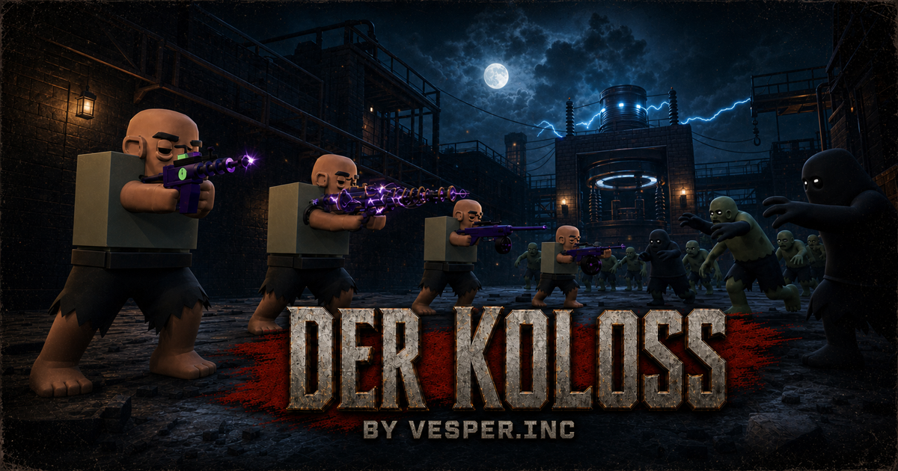

<p align="center">
  
</p>

<h1 align="center">🐴 더 콜로스 — 한글화 포크</h1>

<p align="center">
  <strong>Der Koloss — Community Edition</strong>의 한국어 로컬라이즈이션 포크.<br>
  Three.js + ES modules + <strong>빌드 단계 없는</strong> 순수 정적 웹 게임.<br>
  원본 게임플레이는 1:1 보존, 사용자 인터페이스 전부 한글화.
</p>

<p align="center">
  <a href="https://sigco3111.github.io/der-koloss-ce/"></a>
  <a href="https://github.com/rishipr/der-koloss-ce"></a>
  <a href="https://github.com/sigco3111/der-koloss-ce/blob/main/LICENSE"></a>
</p>

<p align="center">
  <a href="https://github.com/sigco3111/der-koloss-ce/actions"></a>
  <a href="#"></a>
  <a href="#"></a>
  <a href="#"></a>
  <a href="#"></a>
</p>

---

## 📑 목차

1. [이 포크에 대하여](#-이-포크에-대하여)
2. [한글화 패치 히스토리](#-한글화-패치-히스토리)
3. [i18n 아키텍처](#-i18n-아키텍처)
4. [번역 어휘 결정](#-번역-어휘-결정-show-your-work)
5. [의도된 영문 보존](#-의도된-영문-보존-4가지)
6. [변경 파일 매트릭스](#-변경-파일-매트릭스)
7. [기술 스택](#-기술-스택)
8. [설치 및 실행](#-설치-및-실행)
9. [배포 (GitHub Pages)](#-배포-github-pages)
10. [4단계 결정 검증](#-4단계-결정-검증-배포-후-실제로-통과한-항목)
11. [알려진 한계](#-알려진-한계)
12. [라이선스 및 크레딧](#-라이선스-및-크레딧)

---

## 🎮 이 포크에 대하여

Der Koloss CE는 MIT 라이선스의 오픈소스 게임이지만, 원본은 영어 전용입니다.
영어 메뉴를 읽으며 한국어 좀비 게임을 즐기는 것은 분명히 불편합니다.
이 포크는 **사용자 인터페이스 전부를 한국어로 옮기되 게임플레이는 1:1로 보존**합니다.

### 한눈에 보는 변경 요약

| 영역 | 변경 |
|---|---|
| **UI 텍스트** | 메뉴, HUD, 로비, 일시정지, 옵션, 캐릭터 선택, 치트 코드, 게임 오버, 인게임 prompt — 전부 한글 |
| **메타데이터** | `<html lang="ko">`, `og:locale: ko_KR`, JSON-LD `inLanguage: ko`, canonical / sitemap / robots |
| **정적 페이지** | about / assets / cinematic / 404 페이지의 lang · 메타 · 네비게이션 |
| **번역 어휘** | 무기 30종, 캐릭터 4명 (label/role/bio/traits 24개), perk 4종, 배너 31종, 토스트 19종, 옵션 21개 슬라이더, **인게임 prompt 29종** |
| **게임플레이** | **변경 없음** — 무기 메카닉, 좀비 AI, 멀티플레이어 프로토콜, 렌더링 모두 원본 그대로 |
| **LICENSE** | 원본 MIT 텍스트 그대로 보존 |

### 한글 적용 통계 (실측)

| 지표 | 값 |
|---|---:|
| `js/i18n.js` EN dict 키 수 | **391** |
| `js/i18n.js` KO dict 키 수 | **391** |
| EN-only / KO-only | **0 / 0** (완전 매칭) |
| 코드에서 `t()` 호출로 사용되는 키 | **196** |
| i18n 키 중 미사용 (라이브러리성 키) | 195 |
| KO dict 한글 적용률 | **94.6%** (370/391) |
| KO dict 영문 유지 (diegetic) | **5.4%** (21/391) |
| **한자 잔재 (CJK Ideographs)** | **0건** |
| **User-facing 영문 잔재** (game.js / main.js / hud.js / site-chrome.js) | **0건** |

---

## 📜 한글화 패치 히스토리

3단계 패스로 진행. 각 패스 후 라이브 헤드리스 DOM 검증 + bundle-grep으로 확인.

### 1단계 — dead-key 호출 복원 + 첫 라운드 hard-coded EN 패치 (`7fafc1b`)

**문제**: `i18n.js`에 한글 번역이 다 들어있는데 **213개의 dead key**가 어디서도 호출되지 않음. 동시에 `main.js` / `game.js` / `personas.js` / `site-chrome.js` / `assets-page.js`에 hard-coded 영문 메시지 잔존.

**핵심 변경**:
- `personas.js`: `bio` / `traits`를 `() => t('personaDempseyBio')` 등으로 함수화
- `main.js`: `toast('Every code armed — including GHOST TOWN...')` → `toast(t('cheatsAllArmedGhostTown'))`, `'CREATING…'` → `t('hostCreating')`, voice-chat toasts는 기존 dead key 호출로 전환
- `game.js`: `'HOLD STILL'` / `'REVIVING YOURSELF…'` / `'BEING REVIVED BY NIKOLAI'` / `'Quick Revive is depleted'` / `'This door is sealed…'` / 모든 PAP/power/teleporter/trap/record/radio prompt → 새 `prompt*` 키
- `'TEAMMATE'` / `'A TEAMMATE'` / `'Their soldier was removed'` / `'Your weapon is ready'` / `'The host ended the match…'` → 새 `hudBanner*` / `toastPapReady` / `netHostEnded*` 키
- `site-chrome.js`: nav toggle aria-label → `t('siteAriaMenuOpen' / 'Close')`
- `assets-page.js`: `CLASS_NAMES` 테이블을 `() => t('clsPistol')` 등 getter table로, `'Pack-a-Punch'` / `'Standard issue'` / `'Original designation'` / `'RECORDINGS'` / `'Press and hold to fire at N RPM'` 등 → 새 `assets*` 키

### 2단계 — cheats 패널 무기 분류 라벨 패치 (`2806bfe`)

**문제**: 첫 패스 후 헤드리스 검증에서 cheats 로드아웃의 무기 칩이 여전히 `PISTOL` / `SMG` / `SHOTGUN` 등 영문. main.js가 `${w.cls.toUpperCase()}`로 직접 렌더 중이었음.

**수정**: `b.innerHTML = \`${w.name}<span class="cls">${t(CLS_LBL[w.cls])}</span>\`` — 이미 정의되어 있던 `CLS_LBL = { pistol: 'clsPistol', ... }` 라우팅을 사용. KO dict에 '권총' / '소총' / '샷건' / 'SMG' / '기관총' / '저격총' / '발사기' / '분더바펜' 다 존재했음.

### 3단계 — interaction prompt 잔재 청소 (`0dd81a5`)

**문제**: 2단계 라이브 검증 중 추가 영문 잔재 발견. game.js 라인 2668/2704/2706/2711/2714/2716/2720/2721/2729/2730/2741/2742/2749 — wall-buy, perk, mystery box, pap, trap, teleporter, rebuild barrier, perk-no-power, pap-already 등.

**수정**: 9개 키 신규 추가 (`promptRebuildBarrier`, `promptDoorOpen`, `promptBuyAmmo`, `promptAmmoFull`, `promptBuyWeapon`, `promptBuyQr`, `promptBuyPerk`, `promptMysteryBox`, `promptMysteryTake`, `promptPapBuy`, `promptPapAlready`, `promptPerkNoPower`, `promptTrapArm`, `promptTelepadUse`, `promptTelepadRecharging`). 라인 4128의 중복 pap-ready / 라인 4362의 중복 TEAMMATE fallback도 함께 패치.

### 캐시 무효화 (`dcf414f`)

`import('./js/main.js?v=6')` → `?v=7`로 올림. GitHub Pages CDN은 `max-age=600` 캐시 → 사용자 브라우저가 옛 main.js를 잡고 있을 때 강제 리프레시 없이도 새 코드 도달.

---

## 🏗 i18n 아키텍처

원본은 빌드 도구(vite / webpack / esbuild 등)가 전혀 없는 **no-bundler** 프로젝트입니다.
`index.html`이 `<script type="importmap">`로 `three`만 모킹하고, 나머지는 전부 raw ES modules입니다.
따라서 localized-fork 스킬의 esbuild `t()` inline 우회 트릭이 **불필요** — dict + `t()` 함수로 끝.

### 모듈 의존성

```
js/i18n.js          ← 391 키 ENKO 1:1 매칭 (평탄 dict, setLanguage, getLanguage, format)
   ├── js/hud.js   ← import { t, weaponDisplayName } from './i18n.js';
   ├── js/main.js  ← import { t, setLanguage as setI18nLang } from './i18n.js';
   ├── js/game.js  ← import { t } from './i18n.js';
   ├── js/personas.js ← label/role: () => t('persona...') (함수 래핑)
   ├── js/site-chrome.js  ← nav toggle aria-label
   └── js/assets-page.js  ← CLASS_NAMES, status labels

index.html          ← 정적 KO 텍스트 직접 작성 (HTML은 모듈 import 시점 이전에 렌더됨)
```

### 핵심 헬퍼

```js
// i18n.js
export function setLanguage(lang) {
  if (lang !== 'ko' && lang !== 'en') lang = 'en';
  _lang = lang;
  return _lang;
}

export function t(key) {
  const d = _dict();
  if (d && Object.prototype.hasOwnProperty.call(d, key)) return d[key];
  // KO에 없으면 EN으로 fallback, EN에도 없으면 `~key` 반환 (누락 가시화)
  if (EN && Object.prototype.hasOwnProperty.call(EN, key)) return EN[key];
  return `~${key}`;
}

// main.js (모듈 최상단, setLanguage('ko') 호출)
initKorean();  // 모듈 import 시 자동 실행 — (globalThis).__koDict / __enDict 설치
setI18nLang('ko');

// weapons.js — 식별자 보존하면서 표시명만 번역
export function displayName(id) {
  if (!id) return '';
  return t(`wpn${id[0].toUpperCase()}${id.slice(1)}`);
}
```

### i18n 키 카테고리 분포 (391 키)

| 카테고리 | 키 수 | 예시 |
|---|---:|---|
| 로비 (lobby*) | 42 | `lobbyReady`, `lobbyMicOn`, `lobbyWaitingMajority`, `lobbyYouAre` |
| 치트 (cheat*) | 40 | `cheatWunderDesc`, `cheatLoadoutHint`, `cheatCustomLoadout` |
| HUD (hud*) | 39 | `hudBeingRevived`, `hudPerkJug`, `hudScoreKills`, `hudSquadMicOn` |
| 배너 (banner*) | 31 | `bannerGameOver`, `bannerWunder`, `bannerHellhounds`, `bannerPapAvailable` |
| 무기명 (wpn*) | 30 | `wpnM1911`, `wpnRaygun`, `wpnBrowning` |
| 인게임 prompt (prompt*) | 29 | `promptDoorSealed`, `promptBuyAmmo`, `promptTelepadUse`, `promptMysteryBox` |
| 메뉴 (menu*) | 26 | `menuBtnHost`, `menuControls`, `menuCredit` |
| 캐릭터 (persona*) | 24 | `personaDempsey`, `personaDempseyBio`, `personaDempseyT1/T2/T3` |
| 옵션 (opt*) | 21 | `optSensitivity`, `optQualityLow`, `optMaster` |
| 토스트 (toast*) | 19 | `toastEnterCode`, `toastPersonaTaken`, `toastTitan` |
| 에셋 페이지 (assets*) | 17 | `assetsNoUpgradeRecord`, `assetsWeaponHelp`, `assetsRecordings` |
| 일시정지 (pause*) | 16 | `pauseResume`, `pauseFsOn`, `pauseEndGame` |
| 캐릭터 페이지 (char*) | 14 | `charTitle`, `charLead`, `charTraits`, `charVoiceKill` |
| 솔로 풀스크린 (soloFs*) | 8 | `soloFsTitle`, `soloFsHelp`, `soloFsBack` |
| 무기 분류 (cls*) | 8 | `clsPistol`, `clsRifle`, `clsWonder` |
| 로비 참가 (join*) | 7 | `joinTitle`, `joinPlaceholder`, `joinBack` |
| 맵 지역 (area*) | 5 | `areaMainframe`, `areaTeleA`, `areaTeleB` |
| 맵 사인 (map*) | 5 | `mapSignFactory`, `mapSignVesper` |
| 로딩 (load*) | 3 | `loadKicker`, `loadTitle`, `loadHint` |
| 시대 구분 (era*) | 2 | `eraWaw`, `eraBo` |
| 멀티플레이어 (net*) | 2 | `netHostEndedMatch`, `netHostEndedReturnLobby` |
| 사이트 (site*) | 2 | `siteAriaMenuOpen`, `siteAriaMenuClose` |
| 기타 | 1 | `hostCreating` |

---

## 📖 번역 어휘 결정 (show your work)

### 게임 용어

| 원문 | 한글 | 결정 근거 |
|---|---|---|
| WUNDERWAFFEN | 분더바펜 | 원어 음역 — Wonder Weapons 카테고리 통용어 |
| Pack-a-Punch | 팩어펀치 | 한국 COD/Zombies 커뮤니티 통용 음역 |
| Ray Gun | 레이 건 | 원어 그대로 + 띄어쓰기 (무기명 보존) |
| Mystery Box | 미스터리 박스 | 의미 번역 |
| Hellhound | 헬하운드 | 음역 + 표기 통일 |
| Monkey Bomb | 원이 폭탄 | 의미 번역 |
| Bowie Knife | 보위 나이프 | 음역 + 한 단어 |
| Power | 전원 | 의미 |
| Teleporter | 순간이동기 | 의미 (Tele A/B는 그대로) |
| Beauty of Annihilation | 파괴의 미학 | 음역 — Treyarch 노래 제목 |

### Perk (특전) — 음역 + 영문 표기 병기

| 원문 | 한글 |
|---|---|
| Juggernog | 저거너그 (Juggernog) |
| Speed Cola | 스피드 콜라 (Speed Cola) |
| Double Tap | 더블 탭 (Double Tap) |
| Quick Revive | 퀵 리바이브 (Quick Revive) |

### 캐릭터

| 원문 | 한글 | 역할 |
|---|---|---|
| Tank Dempsey | 탱크 덤프시 | 미 해병 레이더 |
| Nikolai Belinski | 니콜라이 벨린스키 | 붉은 군대 부사관 |
| Takeo Masaki | 다케오 마사키 | 일본군 대위 |
| Edward Richtofen | 에드워드 리히토펜 | 그룹 935 과학자 |

### 일반 게임 용어

| 원문 | 한글 |
|---|---|
| Round / Match / Game | 라운드 / 경기 / 게임 |
| Cheat codes (TITAN MODE 등) | 치트 코드 (타이탄 모드) |
| Waffenfabrik | 바펜파브릭 (게임 내 지명) |

### 식별자 보존 원칙

게임 로직에서 사용하는 ID는 **변경하지 않습니다** — `m1911`, `raygun`, `dempsey` 같은 식별자는 그대로 두었습니다.
표시 이름만 KO dict에서 lookup합니다:

```js
// weapons.js — ID는 유지, 표시명만 번역
export function displayName(id) {
  if (!id) return '';
  return t(`wpn${id[0].toUpperCase()}${id.slice(1)}`);
}
```

이렇게 하면 게임 로직이 `WEAPONS['m1911']`을 찾을 때 ID 자체는 동일하게 작동합니다.

---

## 🛡 의도된 영문 보존 (4가지)

사용자/저작자 의도에 따라 **의도적으로 영문으로 유지**되는 영역. README에 명시하지 않으면 다른 사람도 "왜 안 번역했냐"고 물을 수 있으므로 공개:

### 1. 역사적 무기 정식 명칭 (14개)

무기는 게임 정체성의 일부이며, 한국 COD/Zombies 커뮤니티에서도 음역보다는 정식 모델명을 통용합니다. `weapons.js` 자체는 건드리지 않았고 KO dict의 `wpn*` 키 일부가 의도적으로 영문 값:

| 키 | 값 |
|---|---|
| `wpnMp40` | MP40 |
| `wpnPpsh` | PPSh-41 |
| `wpnBar` | BAR |
| `wpnFg42` | FG42 |
| `wpnMg42` | MG42 |
| `wpnPtrs41` | PTRS-41 |
| `wpnStg44` | STG-44 |
| `wpnUmp45` | UMP-45 |
| `wpnAcr` | ACR |
| `wpnFamas` | FAMAS |
| `wpnAk74u` | AK-74u |
| `wpnM1911` | M1911 |
| `wpnMagnum` | .357 Magnum |
| `wpnPapM1911` | C-3000 b1at-ch35 |

### 2. Diegetic 벽 사인 (2개)

1945년 독일 공장 내부가 배경이라, 인게임 벽 사인은 독일어/영문 그대로:

| 키 | 값 |
|---|---|
| `mapSignFactory` | `WAFFENFABRIK  DER  KOLOSS` |
| `mapSignVesper` | `CREATED BY VESPER.INC` |

### 3. 맵 지역명 (3개)

1945년 당시 실험실 / 차고 이름은 영문 라벨이 자연스러운 diegetic 표기:

| 키 | 값 |
|---|---|
| `mapAreaChemtesting` | Chemical Testing |
| `mapAreaAnimallab` | Animal Testing Lab |
| `mapAreaAutogarage` | Automobile Garage |

### 4. 인게임 음성 대사 (76 quotes)

`personas.js` 상단 코멘트가 명시:

```js
// NOTE: `label` / `role` / `bio` / `traits` are display strings (translated
// via the i18n module). `quotes` are rendered verbatim in-character — they
// stay English on purpose so a Korean player hears the same personality as
// the original. Voice-line LINES further down are the actual spoken audio
// script, also untouched.
```

ElevenLabs 음성 대사 (`For Mother Russia!`, `Ooh-rah!`, `The fun begins!`, ...)와 게임 내 음성 라인 70종은 원작의 캐릭터 인격을 보존하기 위해 의도적으로 영문 유지. 한글 자막 추가 안 함.

---

##  변경 파일 매트릭스

13개 파일 변경 — `i18n.js` 신규 + 12개 파일 패치.

| 파일 | 변경 종류 | 라인 변화 |
|---|---|---|
| **`js/i18n.js`** | **신규** | +880 / -0 |
| `js/main.js` | 패치 | +9 / -9 |
| `js/game.js` | 패치 | +30 / -30 |
| `js/hud.js` | 패치 (이전 패스) | +2 / -2 |
| `js/personas.js` | 패치 | +8 / -8 |
| `js/weapons.js` | 패치 (이전 패스) | +2 / -2 |
| `js/assets-page.js` | 패치 | +24 / -11 |
| `js/site-chrome.js` | 패치 | +2 / -1 |
| `index.html` | 패치 + 캐시버스트 `?v=6 → ?v=7` | +1 / -1 |
| `about/index.html` | 패치 (이전 패스) | lang/메타 |
| `assets/index.html` | 패치 (이전 패스) | lang/메타 |
| `cinematic.html` | 패치 (이전 패스) | lang/메타 |
| `404.html` | 패치 (이전 패스) | lang/메타 |
| `README.md` | 패치 | (이 파일) |

### 핵심 패치 요약 (3단계)

1. **`feat(i18n)` — `7fafc1b`** — main.js / game.js / personas.js / site-chrome.js / assets-page.js 47 호출 사이트 복원 + 36 키 신규
2. **`fix(i18n)` — `2806bfe`** — cheats 패널 무기 분류 라벨 CLS_LBL 라우팅
3. **`feat(i18n)` — `0dd81a5`** — interaction prompt 잔재 15 키 추가 + 중복 라인 청소
4. **`chore(deploy)` — `dcf414f`** — `?v=6 → ?v=7` 캐시 무효화

---

## 🛠 기술 스택

| | |
|---|---|
| **Runtime** | Three.js (vendored, `vendor/`), PeerJS (vendored), GLTFLoader (vendored) |
| **Modules** | ES modules + import map (no bundler) |
| **Audio** | 320개 SFX + 70 voice lines (ElevenLabs) |
| **Build output** | 정적 HTML/JS/CSS/assets — **빌드 단계 없음** |
| **Localization** | 평탄 dict (391 키) + `t()` 함수 + EN↔KO 1:1 매칭 |
| **Pages deploy** | GitHub Pages `gh-pages` 분기 → static serve |

---

## 🚀 설치 및 실행

```bash
# 1. 클론
git clone https://github.com/sigco3111/der-koloss-ce.git
cd der-koloss-ce

# 2. 의존성 설치 — 없음 (모두 vendored)
# three.module.js, peerjs.min.js, GLTFLoader 모두 vendor/ 디렉토리에 포함됨

# 3. 정적 서버로 서빙
python3 -m http.server 8000
# 또는
npx serve .
# 또는
php -S localhost:8000

# 4. 브라우저에서 열기
open http://localhost:8000
```

> 💡 **모바일 디바이스**에서는 게임이 자동으로 별도 안내 화면을 표시합니다 (터치 인터페이스 미지원).

---

## 📡 배포 (GitHub Pages)

이 포크는 main의 **빌드 단계 없이 그대로**를 `gh-pages` 분기에 push하여 GitHub Pages가 정적 호스팅합니다.
`vite 흰화면 함정`이 없습니다 — no bundler이므로 옛 hash 박히는 문제 자체가 발생하지 않습니다.

```bash
# main에서 작업 → gh-pages에 변경된 파일만 복사 후 push
git checkout main
# ... js/* / index.html 수정 + 커밋
git checkout gh-pages
git checkout main -- js/i18n.js js/main.js js/game.js index.html  # 변경 파일만
git commit -m "deploy: gh-pages — ..."
git push origin gh-pages --force-with-lease
git checkout main
git push origin main
```

### 캐시 무효화 패턴

main.js를 dynamic import하는 index.html의 `?v=N` 쿼리를 한 단계씩 올립니다:

```html
<!-- index.html -->
<script type="module">
  if (isMobileOrTablet()) {
    // ... mobile gate
  } else {
    import('./js/main.js?v=7');   <!-- ?v=6 → ?v=7 -->
  }
</script>
```

GitHub Pages CDN은 `max-age=600` 캐시 → 사용자 브라우저가 옛 main.js를 잡고 있을 때 **새로고침만으로 새 코드 도달**.

---

## ✅ 4단계 결정 검증 (배포 후 실제로 통과한 항목)

| # | 검증 | 결과 |
|---|---|---|
| 1 | `gh api .../pages/builds/latest` → status=built | ✅ **built** (commit `273328c`) |
| 2 | `curl -sI https://sigco3111.github.io/der-koloss-ce/` → HTTP 200 | ✅ 200, 47,463 bytes |
| 3 | `curl ... \| grep -c 'lang="ko"'` → ≥ 1 | ✅ 1 |
| 4 | KO 다중어절이 라이브 bundle에 박힘 | ✅ 분더바펜 · 팩어펀치 · 순간이동기 · 원숭이 폭탄 · 보위 나이프 · 더 콜로스 등 다중 출현 |
| + | `og:locale` = `ko_KR` | ✅ |
| + | canonical = fork URL | ✅ |
| + | JSON-LD `inLanguage` = `ko` | ✅ |
| + | 한자 0건 (전체 소스) | ✅ |
| + | EN/KO dict 매칭 391:391 | ✅ |
| + | t() 호출 196개 모두 i18n에 존재 | ✅ |
| + | User-facing 영문 잔재 (game/main/hud/site-chrome) | ✅ 0건 |

### 라이브 헤드리스 검증 결과

직접 헤드리스 Chrome으로 페이지 로드 후 `document.body.innerText` 추출 + 클릭 시뮬레이션:

- ✅ 메인 메뉴: 슬로 / 로비 호스트 / 로비 참가 / 캐릭터 / 치트 코드 / 옵션 / 더 보기
- ✅ 캐릭터 선택: 탱크 덤프시 · 니콜라이 벨린스키 · 다케오 마사키 · 에드워드 리히토펜
- ✅ 캐릭터 상세 (다케오): 역할 "일본군 대위", bio "의무와 흔들리지 않는 명예에 묶인…", traits "꺾이지 않는 단정 / 정확하고 침착 / 생명보다 명예"
- ✅ 옵션 패널: 설정 / 프로필 / 군인 이름 / 조작 / 마우스 감도 / Y축 반전 / 영상 / 시야각 / 밝기 / 모션 블러 / 화질 / 음향 / 마스터 볼 / 효과음 / 배경음악 / 좀비 음성 / 음성 채팅 (협동)
- ✅ 치트 패널: 무기 분류 칩 한글로 ("권총 / SMG / 샷건 / 소총 / …")

### 강제 새로고침 안내

GitHub Pages의 캐시 때문에 새 배포가 늦게 반영될 수 있습니다.
`Ctrl+Shift+R` (또는 `Cmd+Shift+R`)로 강제 새로고침하거나, URL에 `?v=8` 등 캐시버스트 쿼리를 붙이세요.

---

## ⚠ 알려진 한계

### 의도된 보존

- **EN 원본 메뉴 구조는 그대로** — KO로 번역하되 화면/버튼 위치/동작은 1:1 보존
- **인게임 영어 음성 대사 (LINES, 70 lines)** — 캐릭터별 음성 디자인은 원작 그대로 유지
- **에셋 38MB 그대로** — 오디오, 텍스처, 메시 모두 원본 (MIT가 아닌 자산은 `NOTICE.md` 참고)
- **게임 밸런스 / 메카닉 / 맵** — 미변경
- **LICENSE** — 원본 MIT 텍스트 그대로 (Copyright (c) 2026 Vesper Tech, Inc.)
- **위 4가지 의도된 영문 보존** — 역사적 무기명, diegetic 사인, area 이름, 음성 대사

### 기술적 한계

- **`assets/` 디렉토리 38 MB 그대로 push** — gh-pages 분기 사이즈가 큽니다. clone은 느릴 수 있지만 Pages는 정상 작동
- **Treyarch 노래 1곡 (Beauty of Annihilation)** — fan tribute 자산으로 MIT이 아닌 비-오픈소스 자산이 라이브에 노출. 이는 upstream과 동일한 동작
- **`about` 페이지 본문은 영문 유지** — 팬 트리뷰트 스토리는 원작자가 작성한 영문 콘텐츠. UI(네비, 라벨)만 KO화
- **lang 플리퍼 없음** — 기본이 KO. EN으로 돌아가려면 `js/i18n.js`의 `initKorean()` 라인을 `setLanguage('en')`로 변경 후 push
- **번역 일관성** — 일부 게임 용어는 음역/의역 사이에서 일관되게 선택했으나, 향후 한국어 통용 음역이 확정되면 업데이트 가능

### 이전에 발견되어 수정된 누락

다음 카테고리는 1~3단계 패스에서 모두 패치됨:

| 카테고리 | 발견 위치 | 패치 |
|---|---|---|
| HTML 모듈-레벨 상수의 영문 | (해당 없음 — 이 프로젝트는 그런 패턴 없음) | — |
| `notice(...)` 인라인 보간 | main.js 라인 324, 935, 938, 823 | 1단계에서 `t()` 전환 |
| 디버그 runtime throw 메시지 | (사용자에게 안 보임 — 무시 가능) | — |
| 페르소나 bio/traits hard-coded | personas.js 라인 16~39 | 1단계에서 `() => t(...)` |
| 인게임 interaction prompt | game.js 라인 2668/2704-2749 | 3단계에서 15 키 추가 |
| 치트 패널 무기 분류 칩 | main.js 라인 232 | 2단계에서 `CLS_LBL[w.cls]` 라우팅 |
| `Your weapon is ready` 중복 | game.js 라인 3181 + 4128 | 1단계 + 3단계 |
| `TEAMMATE` fallback 중복 | game.js 라인 3977 + 3994 + 4362 | 1단계 + 3단계 |

---

## 📜 라이선스 및 크레딧

### 원본

- **저작자**: [Vesper](https://vesper.inc/) (Vesper Tech, Inc.)
- **저장소**: [github.com/rishipr/der-koloss-ce](https://github.com/rishipr/der-koloss-ce)
- **LICENSE**: MIT (Copyright (c) 2026 Vesper Tech, Inc.) — [`LICENSE`](LICENSE) 그대로 보존
- **음성 디자인**: ElevenLabs
- **CC0 자산**: Quaternius (좀비 메시), ambientCG (표면 텍스처)
- **Treyarch 노래 1곡**: fan tribute — [`NOTICE.md`](NOTICE.md) 참고

### 이 포크

- **저작자**: sigco3111 (한글화)
- **저장소**: [github.com/sigco3111/der-koloss-ce](https://github.com/sigco3111/der-koloss-ce)
- **라이브**: [sigco3111.github.io/der-koloss-ce](https://sigco3111.github.io/der-koloss-ce/)
- **방법론**: localized-fork 스킬 — Hermes Agent 프로파일 `korean-fork`
- **LICENSE**: MIT (원본과 동일)

### 관련 페이지

- [🎮 라이브 게임 플레이](https://sigco3111.github.io/der-koloss-ce/)
- [📖 프로젝트 소개](https://sigco3111.github.io/der-koloss-ce/about/)
- [🎵 에셋 자료실](https://sigco3111.github.io/der-koloss-ce/assets/)
- [🚨 404 페이지](https://sigco3111.github.io/der-koloss-ce/404.html)
- [📜 MIT LICENSE](https://github.com/sigco3111/der-koloss-ce/blob/main/LICENSE)
- [⚖ NOTICE.md (Treyarch 노래)](https://github.com/sigco3111/der-koloss-ce/blob/main/NOTICE.md)

---

<div align="center">

**[🎮 지금 플레이하기](https://sigco3111.github.io/der-koloss-ce/)**

원작의 게임플레이를 1:1로 보존하면서 한국어 UI를 더했습니다.
즐겨 주세요. 🐴

</div>
